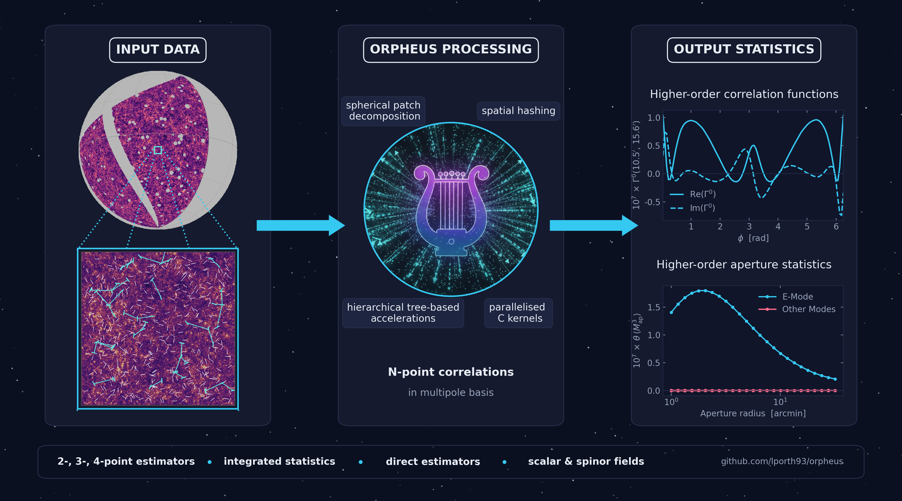
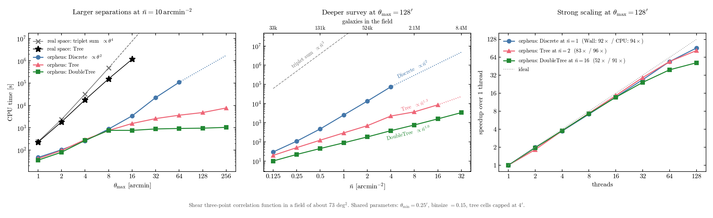
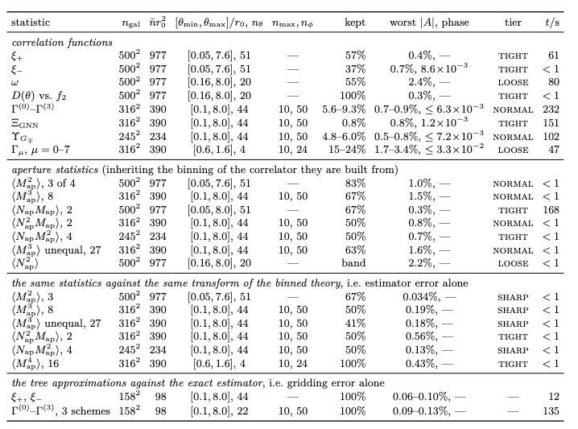

<h1 align="center">
  <span style="font-variant: small-caps;">orpheus</span><br>
   <span style="font-size:0.7em; font-weight:normal;">
    Efficient estimators for higher-order correlation functions
  </span>
</h1>

<p align="center">
  <a href="https://github.com/lporth93/orpheus/actions/workflows/ci.yml"></a>
  <a href="https://pypi.org/project/orpheus-npcf/"></a>
  <a href="https://orpheus.readthedocs.io/"></a>
</p>

<span style="font-variant: small-caps;">orpheus</span> is a high-performance Python package for the estimation 
of second-, third-, and fourth-order correlation functions of scalar and polar fields such as weak lensing shear. 
To make these calculations computationally tractable, <span style="font-variant: small-caps;">orpheus</span> 
makes use of a multipole decomposition of the N>2 correlation functions and combines it with hierarchical spatial 
algorithms, with the computationally intensive operations implemented in parallelized C kernels.

This framework makes the estimation of higher-order statistics feasible for ongoing and forthcoming stage-IV 
cosmological surveys containing hundreds of millions of objects. As a ballpark estimate, 
<span style="font-variant: small-caps;">orpheus</span>  can accurately determine how the $10^{18}$ 
triangles formed by a catalogue of one million objects are distributed across configuration-space 
bins within a few CPU minutes, with the computational complexity scaling approximately linear with 
the number of objects.

<div align="center">

📦 [PyPI](https://pypi.org/project/orpheus-npcf/) &nbsp;·&nbsp; 
📖 [Documentation](https://orpheus.readthedocs.io/) &nbsp;·&nbsp; 
⚙️ [Algorithms](https://orpheus.readthedocs.io/algos.html) &nbsp;·&nbsp; 
💻 [Tutorial notebooks](https://orpheus.readthedocs.io/tutorial.html) &nbsp;·&nbsp; <br>
🧪 [Numerical validation](#numerical-validation) &nbsp;·&nbsp; 
⚡ [Performance](#performance)
</div>




## Quickstart 

<span style="font-variant: small-caps;">orpheus</span> is installable from PyPI, so a simple 
`pip install orpheus-npcf` should get you the latest pre-compiled version.

The computation of any higher-order correlation function follows the same pattern; below we 
give an example to compute third-order shear statistics. For a fully worked example see the 
introductory [tutorial notebook](https://orpheus.readthedocs.io/notebooks/GGG_tutorial_basic.html)

```python
import orpheus 

yourshapecat = load_your_catalog()
binning = define_your_binning()

# Define catalog and correlator
cat = orpheus.SpinTracerCatalog(yourshapecat)
ggg = orpheus.GGGCorrelation(binning)

# Process the catalog to obtain 3pcf in multipole basis
ggg.process(cat)

# Transform to real-space basis
ggg.multipoles2npcf()

# Optionally compute integrated statistics
apradii = ...
map3 = ggg.computeMap3(apradii)

```

## Featured statistics
Currently,  <span style="font-variant: small-caps;">orpheus</span> contains estimators for the 
following correlation functions. 

|         | Pure scalar (N) | Pure polar (G) | Mixed |  Full tomography  |    Integrated Statistics     | 
| :------ | :----: | :--: | :---: | :--: |  :------------------: |
| **2pt** |    ✓   |   ✓  |   ✓   |   ✓  | Aperture Statistics <br>COSEBIs · Pure mode CFs |
| **3pt** |    ✓   |   ✓  |   ✓   |   ✓  |  Aperture statistics |
| **4pt** |    ✓   |   ✓  |   GNNN   |   ✗  |           Aperture statistics        |

In addition, <span style="font-variant: small-caps;">orpheus</span> also implements direct estimators 
for aperture statistics of arbitrary order for pure scalar and polar correlators.

Almost all correlators are featured in the [tutorial notebooks](https://orpheus.readthedocs.io/tutorial.html) --
the exception is GNNN, for which no notebook is published yet. 
In there you can also find worked examples on how to measure the statistics on realistic catalogs on the 
celestial sphere, how to handle tomography and how to customize the level of accuracy of the estimators.

## Performance

We showcase the performance of <span style="font-variant: small-caps;">orpheus</span> using the 
example third-order shear correlations. In the panels below we compare the scaling properties of 
orpheus' different implementation of the multipole-based estimator and compare it to traditional 
estimators operating purely in real space:



The different <span style="font-variant: small-caps;">orpheus</span> implementations show substantially 
better scaling than their real-space counterparts. In particular:

* **More configurations:** Both tree-based estimators show a much more shallow scaling when 
  increasing the largest search distance; the DoubleTree in particular nearly plateaus.
* **Larger datasets:** The DoubleTree estimator maintains near-linear scaling with survey depth, 
  making it well suited to increasingly large catalogues. 
* **Parallel performance:** the implementation achieves near-ideal strong scaling up to 32 threads, 
  with diminishing returns at higher thread counts. This is partly due to the non-scaling spatial 
  organisation of the catalog which becomes less significant for larger datasets.

The figure can be reproduced with `python benchmarks/scaling.py run` followed by
`python benchmarks/scaling.py plot`. The same script can also be used to perform a similar
scaling test on your machine.

## Numerical validation
The estimators implemented in <span style="font-variant: small-caps;">orpheus</span> are validated 
against reference results based on a field with analytically tractable correlation functions and 
aperture statistics. These tests are used to verify the implementations and to quantify the accuracy 
of the available approximation schemes. 

Below we show outcome of the test suite; for a full reference 
including the derivation of the expressions and for a motivation of the test setup we refer to the 
following [notes](docs/source/notes/analytic_shear_field.pdf).

<div align="center">


</div>

## Installation

orpheus is on PyPI:
```shell
pip install orpheus-npcf
```

Building from source instead compiles a parallelised C/C++ extension at install
time. Besides the python requirements you therefore need a C compiler with
OpenMP support (GCC, or Clang together with `libomp`). No external C libraries
are needed: the small HEALPix subset used by the curved-sky estimators is
shipped with <span style="font-variant: small-caps;">orpheus</span>, in `orpheus/src/healpix/`.

In case you want to compile the package from source you can do this by first cloning 
the github repository 
```shell
git clone git@github.com:lporth93/orpheus.git
```
or
```shell
git clone https://github.com/lporth93/orpheus.git
```
Then navigate to the cloned directory and install:
```shell
cd orpheus
pip install .
```
For more detailed installation instructions, troubleshooting and optional flags 
please consult the corresponding section in the [documentation](https://orpheus.readthedocs.io/installation.html).

## Citations
<span style="font-variant: small-caps;">orpheus</span> implements and extends methods developed 
in several papers. Please cite the publications relevant to the estimators used in your work:
 * **Three-point functionality:** [Porth et al. 2024](https://doi.org/10.1051/0004-6361/202347987)
 * **Four-point functionality:**  [Porth et al. 2025](https://arxiv.org/abs/2509.07974) and [Silvestre-Rosello et al. 2025](https://doi.org/10.1051/0004-6361/202557147)
 * **Direct estimator functionality:** [Porth & Smith 2022](https://doi.org/10.1093/mnras/stab2819)
 * **Two-point functionality:** Please provide a [reference](https://github.com/lporth93/orpheus) to the official GitHub repository in a footnote
 * **Fully spherical estimators:** Please also cite the original  HEALPix paper: [Gorski+2005](https://doi.org/10.1086/427976)


In each of the papers, you can find the main equations implemented in <span style="font-variant: small-caps;">orpheus</span>.