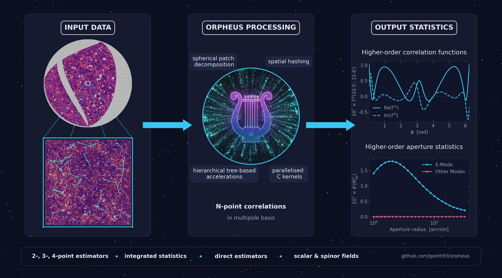

Welcome to orpheus' documentation!
===================================

*Orpheus* is a high-performance Python package for the estimation 
of second-, third-, and fourth-order correlation functions of scalar and polar fields such as weak lensing shear. 
To make these calculations computationally tractable, *orpheus* 
makes use of a multipole decomposition of the :math:`N>2` correlation functions and combines it with hierarchical spatial 
algorithms, with the computationally intensive operations implemented in parallelized C kernels.

This framework makes the estimation of higher-order statistics feasible for ongoing and forthcoming
stage-IV cosmological surveys containing hundreds of millions of objects. As a ballpark estimate,
*orpheus* can accurately determine how the :math:`10^{18}` triangles formed by a catalogue of one
million objects are distributed across configuration-space bins within a few CPU minutes, with the
computational complexity scaling approximately linear with the number of objects.

   *Orpheus'* main workflow to compute NPCFs: The input catalog is organised into a spatial hierarchy, 
   then the correlator is estimated in the multipole basis, afterwards transformed to real space, and 
   optionally compressed into integrated statistics such as the aperture mass.

.. note::
   This project is under active development.

Quickstart
----------
*Orpheus* is installable from PyPI, so a simple ``pip install orpheus-npcf`` should get you the
latest pre-compiled version.

The computation of any higher-order correlation function follows the same pattern; below we give an
example to compute third-order shear statistics. For a fully worked example see the introductory
:doc:`tutorial notebook <notebooks/GGG_tutorial_basic>`.

.. code-block:: python

   import orpheus

   yourshapecat = load_your_catalog()
   binning = define_your_binning()

   # Define catalog and correlator
   cat = orpheus.SpinTracerCatalog(yourshapecat)
   ggg = orpheus.GGGCorrelation(binning)

   # Process the catalog to obtain 3pcf in multipole basis
   ggg.process(cat)

   # Transform to real-space basis
   ggg.multipoles2npcf()

   # Optionally compute integrated statistics
   apradii = ...
   map3 = ggg.computeMap3(apradii)

User Guide
----------
.. toctree::
   :maxdepth: 1
   
   installation
   twopcf
   threepcf
   fourpcf
   direct
   algos
   tutorial
   
API documentation
-----------------
.. toctree::
   :maxdepth: 1
   
   api

Support
-------
In case you encounter any issue with orpheus, please raise an issue on the GitHub page.

Citations
---------
*Orpheus* implements and extends methods developed in several papers. Please cite the
publications relevant to the estimators used in your work:

* **Three-point functionality:** `Porth et al. 2024 <https://doi.org/10.1051/0004-6361/202347987>`_
* **Four-point functionality:** `Porth et al. 2025 <https://arxiv.org/abs/2509.07974>`_ and
  `Silvestre-Rosello et al. 2025 <https://doi.org/10.1051/0004-6361/202557147>`_
* **Direct estimator functionality:** `Porth & Smith 2022 <https://doi.org/10.1093/mnras/stab2819>`_
* **Two-point functionality:** please provide a `reference <https://github.com/lporth93/orpheus>`_
  to the official GitHub repository in a footnote
* **Fully spherical estimators:** please also cite the original HEALPix paper,
  `Gorski et al. 2005 <https://doi.org/10.1086/427976>`_

In each of the papers you can find the main equations implemented in *orpheus*.

Indices and tables
==================

* :ref:`genindex`
* :ref:`modindex`
* :ref:`search`

